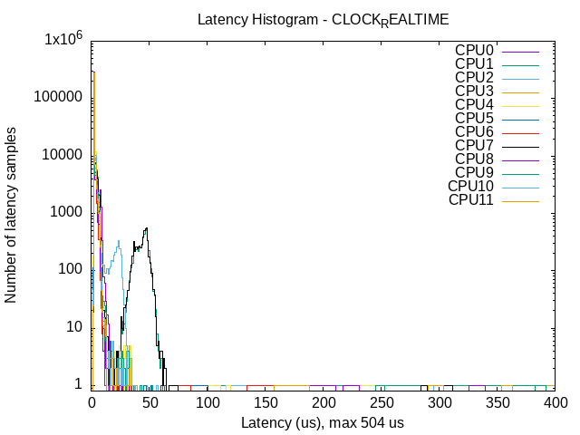
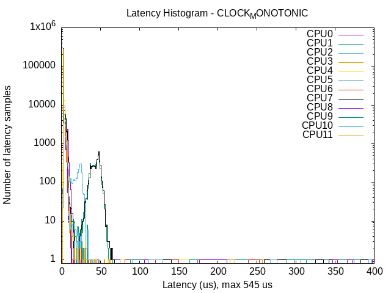

# DOTFILES | AMD-focused
Since I'm a full AMD user, none of the following configuration files are guaranteed to work outside of AMD.

## Specs
- CPU: AMD Ryzen 5 5600XT (6c/12t)
- RAM: 32GB RAM DDR4 @ 3200 MHz (1600 MT/s)
- GPU: AMD Radeon RX 570 OC 8GB

## Latency Analysis

Real-time kernel latency measurements for AMD Ryzen 5 5600XT using [cyclictest](https://wiki.linuxfoundation.org/realtime/documentation/howto/tools/cyclictest).

### CLOCK_MONOTONIC vs CLOCK_REALTIME

The following plots compare latency characteristics across both monotonic and realtime clock sources:

**CLOCK_MONOTONIC** - Measures elapsed time unaffected by system clock adjustments:

**CLOCK_REALTIME** - Measures elapsed time tied to system wall clock:

#### Test Parameters
- **Duration:** 1 minute
- **Priority:** 90 (SCHED_FIFO)
- **Interval:** 200 µs
- **Histogram Resolution:** 400 µs buckets
- **Mode:** System-wide SMP with memory locking enabled
- **Reference Clock:** [CLOCK_MONOTONIC](https://man7.org/linux/man-pages/man2/clock_gettime.2.html)

#### Interpretation

- **Y-axis (logarithmic scale):** Number of latency samples in each bucket
- **X-axis:** Latency measurement in microseconds (µs), capped at 400 µs
- **Multiple lines:** Represent latency distributions per CPU core

For more information on real-time performance tuning, see the [Real-Time Linux Wiki](https://wiki.linuxfoundation.org/realtime/start).
